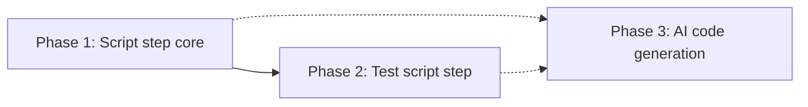

# Custom Workflow Script Step — Phase-Wise Implementation Plan

This plan implements the **Run Script** step (user-defined code to transform request/working/response), **Test** (run script with sample payload before save), and **AI code generation** (plain English → script body). It is aligned with [custom-workflow-script-step-ideation.md](./custom-workflow-script-step-ideation.md).

---

## Overview

| Phase | Focus | Deliverables |
|-------|--------|---------------|
| **Phase 1** | Script step core | Handler, step type, basic UI (script editor + timeout), custom flows support |
| **Phase 2** | Test script step | Test endpoint, Test panel in step editor (sample input, run, result) |
| **Phase 3** | AI code generation | Generate endpoint (Bedrock), “Generate with AI” in step editor |

Phases are sequential: Phase 2 depends on the script runner from Phase 1; Phase 3 is independent of Phase 2 but logically follows “edit → test” with “generate → edit → test.”

---

## Phase 1: Script Step Core

**Goal:** User can add a `run_script` step to an orchestrator or custom flow, provide inline JavaScript that receives `(request, working, response, scope)` and mutates `working`/`response`, and save/run the flow.

### 1.1 Contracts and config

- **Package: `packages/contracts`**
  - In `StepConfig` (or equivalent), add optional: `scriptSource?: string`, `timeoutMs?: number`.
  - Document the script step contract (signature, in-place mutation, no I/O) in a comment or small doc block.
- **Step type:** `run_script` (add to any shared enum or list of step types used by frontend and backend).

### 1.2 Script runner (shared execution)

- **Location:** `orchestrators/core-rating` (e.g. `src/script/script-runner.ts` or next to execution).
- **Responsibility:** Single function that:
  - Accepts `{ scriptSource, request, working, response, scope, timeoutMs }`.
  - Builds sandbox context with only those four objects (deep clone or copy so mutations don’t leak).
  - Wraps user script in a function `(request, working, response, scope) => { ... }` and runs it in `vm.runInNewContext` with timeout.
  - Returns `{ success: boolean, working?, response?, error?, durationMs }`. No side effects; no DB or HTTP.
- **Security:** Expose only `request`, `working`, `response`, `scope` in the vm context. No `require`, `process`, `global`, or `eval` in user scope. Default timeout e.g. 5000 ms, max 30000 ms.

### 1.3 Run Script handler

- **Location:** `orchestrators/core-rating/src/handlers/run-script.handler.ts`.
- **Behavior:**
  - Read `config.scriptSource` (required) and `config.timeoutMs` (optional).
  - Call the script runner with `context.request`, `context.working`, `context.response`, `context.scope`.
  - On success: set `context.working` and `context.response` from runner result; return step `completed` with optional output (e.g. `durationMs`).
  - On failure: return step `failed` with `error`; do **not** mutate context.
- **Validation:** `validate(config)` requires non-empty `scriptSource`, optional `timeoutMs` in range.
- **Registration:** Register handler in `handlers.module.ts` and step-handler registry under type `run_script`.

### 1.4 Line-rating / orchestrator

- **Orchestrator steps:** Ensure orchestrator flow steps can persist `stepType: 'run_script'` and `config: { scriptSource, timeoutMs }`. (DB and APIs likely already support generic step_type + config.)
- **Custom flows:** In `orchestrators/line-rating` (e.g. `custom-flows.service.ts`), add `'run_script'` to `ALLOWED_CUSTOM_FLOW_STEP_TYPES` so custom flows can include script steps.

### 1.5 Frontend — step type and config UI

- **Step type:** Add `run_script` to the list of step types in the orchestrator step editor (e.g. `ProductDetail.tsx` or step config components). Label: e.g. “Run script”.
- **Config form for `run_script`:**
  - **Script source:** Textarea or code editor (e.g. Monaco) for `scriptSource`. Placeholder or help text: “JavaScript that receives (request, working, response, scope) and may mutate working and response.”
  - **Timeout (optional):** Number input for `timeoutMs` (default 5000, max 30000).
  - Save/load from step `config` when editing the step.
- **Execution diagram / badges:** Show `run_script` in the flow diagram and step list with a distinct label/color (e.g. “Run script”).

### 1.6 Documentation

- Add a short “Script step” section to ARCHITECTURE (or create `docs/script-step.md`): script contract (signature, allowed mutations, timeout, no I/O), security assumptions, that the runtime is the same as the orchestrator (JavaScript).

### Phase 1 exit criteria

- User can add a `run_script` step to main orchestrator and to a custom flow, enter JavaScript, set optional timeout, save, and run the flow. The script’s mutations to `working`/`response` are visible to subsequent steps. On script error or timeout, the step fails and context is not mutated.

---

## Phase 2: Test Script Step

**Goal:** User can run the current script against sample request/working/response in the step editor and see the result without executing the full flow.

### 2.1 Test endpoint

- **Location:** `orchestrators/core-rating`. New route, e.g. `POST /api/v1/script/run` (or under existing API prefix).
- **Request body:** `{ scriptSource, request, working?, response?, scope?, timeoutMs? }`. Defaults: `working = request` if omitted, `response = {}`, `scope = {}`.
- **Response:** `{ working, response, error?, durationMs? }`. On success, `error` absent; on failure, `error` is a string, `working`/`response` may be omitted or unchanged.
- **Implementation:** Call the same script runner used by the handler (Phase 1). No auth change required if the existing orchestrator API is already protected; otherwise reuse same auth as other core-rating endpoints.

### 2.2 Frontend — Test panel

- **Where:** Inside the step config form for `run_script` (below or beside the script editor).
- **Layout:** Collapsible “Test” section containing:
  - **Sample input:** JSON text areas (or a single JSON blob) for `request` and optionally `working`, `response`, `scope`. Prefill with minimal example (e.g. `{}` or `{ "request": {} }`).
  - **Run test** button: POST to the test endpoint with current `scriptSource` and the sample payload. Show loading state.
  - **Result:** Success path — show updated `working` and `response` (e.g. side-by-side or before/after). Failure path — show `error` message. Optionally show `durationMs`.
- **No persistence:** Test does not save the step or the flow; it only runs the current script in the editor.

### Phase 2 exit criteria

- In the step editor for `run_script`, user can open the Test section, enter sample JSON, click Run test, and see either the updated working/response or an error. Same script and timeout behavior as in production.

---

## Phase 3: AI Code Generation

**Goal:** User can describe in plain English what the script should do and get a generated JavaScript body inserted into the script editor, then edit and test as usual.

### 3.1 Generate endpoint

- **Location:** Prefer **rules-service** (already has Bedrock and “generate from natural language” patterns). Alternative: core-rating if we add Bedrock there.
- **Route:** e.g. `POST /api/v1/script/generate` (or `/rules/script/generate` if in rules-service).
- **Request body:** `{ prompt: string, productLineCode?: string, contextSample?: Record<string, unknown> }`. `contextSample` is optional example request/working shape so the model can use real field names.
- **Behavior:**
  - Build a **system prompt** that includes: (1) script contract — function `(request, working, response, scope)`, mutate in place; (2) “Output only the JavaScript function body, no markdown, no explanation”; (3) 1–2 short example snippets.
  - Append user `prompt` (and optionally “Example context shape: …” from `contextSample`).
  - Call Bedrock (Claude); get response; strip markdown code fences (e.g. ```javascript … ```); trim.
  - Return `{ scriptSource: string, confidence?: number }`. On Bedrock failure, return 5xx or a structured error; optional fallback: return a minimal “stub” script or heuristic-generated snippet.
- **Security:** Do not pass untrusted input into the system prompt; user input only in the user message. Validate response length and basic JS sanity if desired.

### 3.2 Frontend — Generate with AI

- **Where:** In the step config form for `run_script`, above or beside the script editor (e.g. “Generate with AI” panel or button).
- **UI:**
  - Text input or textarea for the user’s prompt (e.g. “If building age > 30 and state is CA, set working.surcharge = 0.15”).
  - Optional: “Use sample context” to send current Test panel sample (if any) as `contextSample` for better field names.
  - **Generate** button: POST to generate endpoint; on success, **insert or replace** the content of the script editor with `scriptSource`. Optionally show a short “Generated — review and test” message.
  - On error: show error message (e.g. “AI generation failed. Check Bedrock credentials.”).
- **Flow:** Generate → user reviews/edits script → user can run Test (Phase 2) → save step. No automatic “run test after generate” required for v1.

### 3.3 Documentation

- In the script step docs, add: “Generate with AI: describe what the script should do in plain English; the generated code is a starting point — always review and test before saving.”

### Phase 3 exit criteria

- User can click “Generate with AI”, enter a description, get a script body inserted into the editor, and optionally run Test and save. Generated code runs in the same sandbox as hand-written code; no extra privileges.

---

## Dependencies and order



- **Phase 2** depends on Phase 1 (script runner and handler exist; test endpoint reuses runner).
- **Phase 3** can be started after Phase 1 (only needs script contract and editor); better UX if Test is available (Phase 2) so users can validate generated code immediately.

---

## Out of scope (v1)

- Script library / versioned scripts (reference by ID): deferred; script is inline in step config only.
- Async script (Promise): deferred; sync only.
- Multiple languages (e.g. Python): deferred; JavaScript only.
- “Regenerate on error” or multi-turn AI: deferred.
- Isolated-vm or separate script-runner service: deferred; Node `vm` in-process.

---

## Summary

| Phase | Main deliverables |
|-------|-------------------|
| **1** | Script runner module, run-script handler, `run_script` in contracts and UI, custom flows allow `run_script`, script step docs |
| **2** | `POST /script/run` test endpoint, Test panel in step editor (sample input, Run test, result) |
| **3** | `POST /script/generate` (rules-service), “Generate with AI” panel and insert script into editor |

After all three phases: users can add a script step, optionally generate it with AI, test it with sample data, and run it in the main or custom flow.
